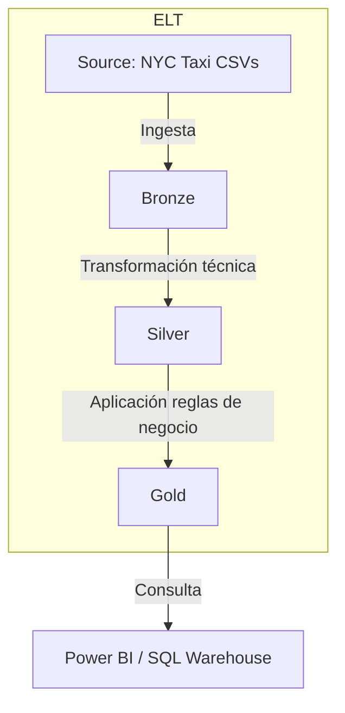

# 🏙️ NYC Taxi Data Pipeline: Arquitectura ELT & Medallion para BI

  
  
  


## 📌 Visión general

Este repositorio contiene un **pipeline de datos end‑to‑end** construido sobre una arquitectura **Medallion (Bronze → Silver → Gold)** y ejecutado como un proceso ELT en **Azure Databricks**. El objetivo es transformar los datos crudos del histórico de taxis de Nueva York en una capa Gold lista para análisis de negocio en **Power BI Pro**.

> **¡Explora el dashboard en vivo!**  
> [Abrir informe interactivo](https://app.powerbi.com/view?r=eyJrIjoiMzVkZTI0YzMtYTU1Yi00ZTljLWEyOTEtODE2Zjk1NjAzZjdiIiwidCI6ImRmNGI2MzcyLWEwM2EtNDZmMC05YmY1LTdmOGQzNzhhMzMzNCIsImMiOjR9)

---

## ⚙️ Stack tecnológico y flujo ELT

| Capa | Herramientas / Tecnologías |
|------|----------------------------|
| Ingesta | Azure Blob Storage → Databricks |
| Transformación (ELT) | Apache Spark SQL, notebooks Python |
| Gobernanza | Unity Catalog |
| Orquestación | Medallion Architecture (bronze/silver/gold) |
| Visualización | Power BI Pro (SQL Warehouse) |

> **Proceso ELT**:  
> 1. *Extract* datos crudos desde el lago de datos.  
> 2. *Load* en la capa Bronze con particionado y versionado.  
> 3. *Transform* en Silver (limpieza y estandarización) y Gold (reglas de negocio).

---

## 🏗️ Arquitectura del pipeline

Este proyecto implementa un flujo de datos de extremo a extremo bajo el paradigma ELT (Extract, Load, Transform). En lugar de extraer los datos para procesarlos localmente, se utilizó el framework Kedro como orquestador para enviar instrucciones de transformación (Spark SQL) directamente al clúster de Azure Databricks, aprovechando su poder de cómputo distribuido para procesar la Arquitectura Medallion (Bronze -> Silver -> Gold) de forma in situ, eficiente y escalable.



---

## 📊 Calidad de datos & perfilado

### 1. Auditoría de limpieza

```sql
SELECT 
    CASE 
        WHEN trip_distance <= 0 THEN 'Error: Distancia Cero/Negativa'
        WHEN total_amount <= 0 THEN 'Error: Monto Negativo'
        WHEN passenger_count = 0 THEN 'Inconsistencia: Cero Pasajeros'
        ELSE 'Registros Válidos (Gold)'
    END AS categoria_calidad,
    count(*) as total_registros
FROM main.gestion_silver.silver_yellow_trips
GROUP BY 1;
```

| Categoría de Calidad                       | Total Registros | Impacto   |
|-------------------------------------------|-----------------|-----------|
| Registros Válidos (Gold)                  | 12 135 919      | 99.38 %   |
| Error: Distancia Cero/Negativa            | 71 126          | 0.58 %    |
| Error: Monto Negativo                     | 3 717           | 0.03 %    |
| Inconsistencia: Cero Pasajeros            | 190             | <0.01 %   |

### 2. Tratamiento de outliers

- **Máximo en Silver (raw error):** 19 072 628,8 millas  
- **Máximo en Gold (filtrado):** 401,1 millas

### 3. Perfilado métodos de pago

| Payment Type | Descripción     | Conteo    | Porcentaje |
|--------------|-----------------|-----------|------------|
| 1            | Tarjeta de Crédito | 8 127 385 | 66.56 %   |
| 2            | Efectivo           | 4 020 406 | 32.92 %   |
| 3            | Sin Cargo          | 46 913    | 0.38 %    |
| 4            | Disputa            | 16 240    | 0.13 %    |

---

## 📈 KPIs destacados del dashboard

- **Ticket promedio:** 15.95 USD/viaje  
- **Tasa de propinas:** 14.08 % (tarjeta)  
- **Rentabilidad por milla** por proveedor (VendorID)  
- **Picos de demanda:** 15:00–20:00 hrs  

> El dashboard se alimenta directamente de las tablas Gold, garantizando que los indicadores se basen en datos depurados y gobernados.

---

## 📁 Estructura del repositorio

```
├── build/                 # Paquetes compilados
├── conf/                  # Configuraciones (catalog, parámetros, credenciales)
├── data/                  # Capas del data lake (01_raw…08_reporting)
├── docs/                  # Documentación Sphinx
├── notebooks/             # Notebooks exploratorios
├── src/                   # Código fuente del paquete ny_tripdata
│   ├── pipelines/         # Definiciones de pipelines Bronze/Silver/Gold
│   └── settings.py
└── tests/                 # Pruebas unitarias

---

## 📝 Notas finales

- Proceso construído siguiendo principios **ELT** y **Data Lakehouse**.  
- Todas las transformaciones se realizan dentro de **Databricks** utilizando **Spark SQL** y Python.  
- La gobernanza de datos se maneja con **Unity Catalog** y versionado Delta Lake.  
- La solución está lista para ser desplegada en entornos de producción con orquestadores adicionales (Airflow, Prefect, etc.).
